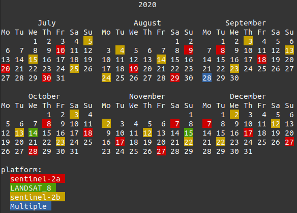
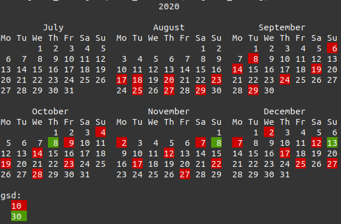
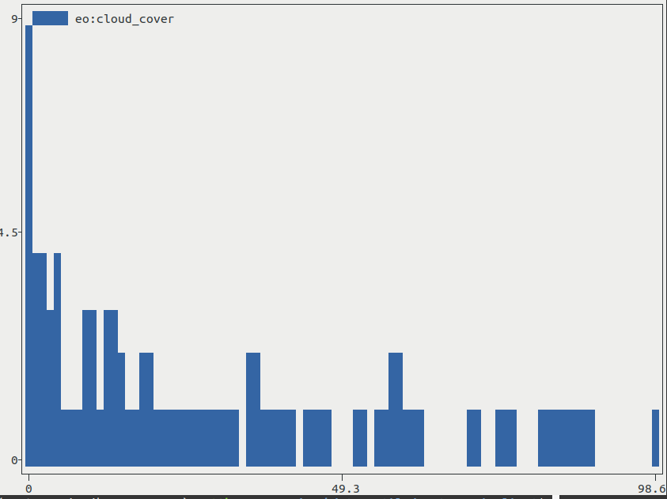
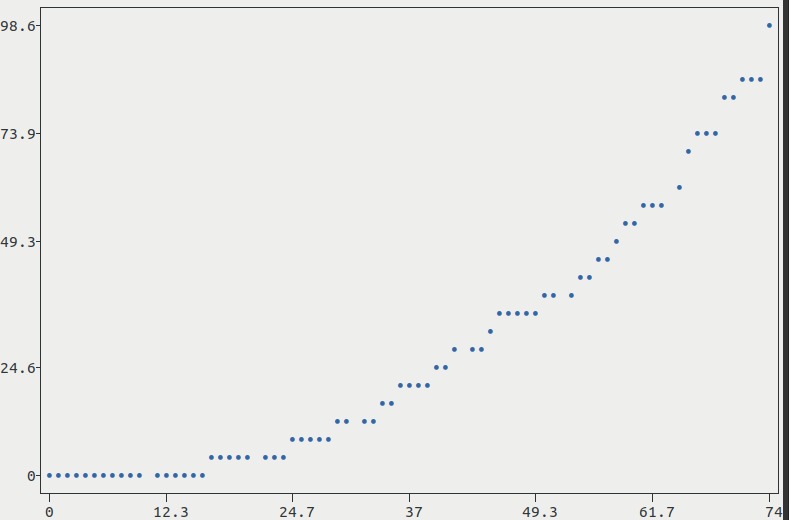

# stacterm

This library is for displaying information (tables, calendars, plots, histograms) about [STAC](https://stacspec.org/) Items in the terminal. It takes as input a STAC ItemCollection (a GeoJSON FeatureCollection of STAC Items), either by specifying a filename or by piping output from another program.

## Installation

Install from PyPi:

```
$ pip install stacterm
```

PySTAC and Pandas are required, along with two dependencies for rendering tables (`termtables`) and plots (`plotext`) in the terminal.

## Usage

The detailed usage examples below are shown using a saved file, however `stacterm` can also read in stdin allowing other programs to pipe output to it, such as [pystac-api-client](https://github.com/stac-utils/pystac-api-client).

```
$ export STAC_API_URL=https://earth-search.aws.element84.com/v0
$ stac-client search --intersects aoi.json --datetime 2020-07-01/2020-12-31 -c sentinel-s2-l2a-cogs landsat-8-l1-c1 | stacterm cal --label platform
```



All of the sub-commands in `stacterm` can take optional field names. A field name is:

- `id`: The ID of the Item
- `date`: The date portion of the Item's `datetime` field
- `collection`: The collection of the Item
- Any property


### Tables

Use `stacterm` to display tabularized data from a saved ItemCollection.

```
$ stacterm table items.json

| id                                       | date       |
|------------------------------------------|------------|
| LC08_L1TP_026079_20201014_20201104_01_T1 | 2020-10-14 |
| LC08_L1TP_026079_20201115_20201210_01_T1 | 2020-11-15 |
| S2A_12JXQ_20201008_0_L1C                 | 2020-10-08 |
```

By default this is a markdown table (note the terminal will not render Markdown)

| id                                       | date       |
|------------------------------------------|------------|
| LC08_L1TP_026079_20201014_20201104_01_T1 | 2020-10-14 |
| LC08_L1TP_026079_20201115_20201210_01_T1 | 2020-11-15 |
| S2A_12JXQ_20201008_0_L1C                 | 2020-10-08 |

The fields displayed can be changed via the `--fields` keyword, and sorted via the `--sort` keyword.

```
$ stacterm table items.json --fields date eo:cloud_cover collection --sort eo:cloud_cover

| date       | eo:cloud_cover | collection           |
|------------|----------------|----------------------|
| 2020-10-13 | 0.0            | sentinel-s2-l1c      |
| 2020-10-13 | 0.0            | sentinel-s2-l2a      |
| 2020-10-13 | 0.0            | sentinel-s2-l2a-cogs |
| 2020-10-13 | 0.0            | sentinel-s2-l1c      |
```

The style of the table can also be changed via the `--style` keyword, although it will no longer be usable in a Markdown renderer. See [termtables styles](https://github.com/nschloe/termtables/blob/master/termtables/styles.py) for list of styles.

```
$ stacterm table items.json --fields id date platform sentinel:grid_square --sort date --style thick

┏━━━━━━━━━━━━━━━━━━━━━━━━━━━━━━━━━━━━━━━━━━┳━━━━━━━━━━━━┳━━━━━━━━━━━━━┳━━━━━━━━━━━━━━━━━━━━━━┓
┃ id                                       ┃ date       ┃ platform    ┃ sentinel:grid_square ┃
┣━━━━━━━━━━━━━━━━━━━━━━━━━━━━━━━━━━━━━━━━━━╋━━━━━━━━━━━━╋━━━━━━━━━━━━━╋━━━━━━━━━━━━━━━━━━━━━━┫
┃ S2B_12JXR_20201003_0_L2A                 ┃ 2020-10-03 ┃ sentinel-2b ┃ XR                   ┃
┣━━━━━━━━━━━━━━━━━━━━━━━━━━━━━━━━━━━━━━━━━━╋━━━━━━━━━━━━╋━━━━━━━━━━━━━╋━━━━━━━━━━━━━━━━━━━━━━┫
┃ S2B_12JXQ_20201003_0_L1C                 ┃ 2020-10-03 ┃ sentinel-2b ┃ XQ                   ┃
┣━━━━━━━━━━━━━━━━━━━━━━━━━━━━━━━━━━━━━━━━━━╋━━━━━━━━━━━━╋━━━━━━━━━━━━━╋━━━━━━━━━━━━━━━━━━━━━━┫
┃ S2B_12JXQ_20201003_0_L2A                 ┃ 2020-10-03 ┃ sentinel-2b ┃ XQ                   ┃
┗━━━━━━━━━━━━━━━━━━━━━━━━━━━━━━━━━━━━━━━━━━┻━━━━━━━━━━━━┻━━━━━━━━━━━━━┻━━━━━━━━━━━━━━━━━━━━━━┛
```

### Calendars

A UNIX-like calendar (see [`cal`](https://en.wikipedia.org/wiki/Cal_(Unix))) is available to show dates of individual items. By default `cal` will use the field `datetime` (the collection datetime) and group Items by their Collection. These can be overridden by the `--date_field` and `--label_field` keywords. Note that the specified `--date_field` needs to be a date field, such as `created` or `updated`.

```
$ stacterm cal items.json --date_field created --label_field gsd
```



### Histograms

Histograms can be created for any numeric field.

```
$ stacterm hist items.json eo:cloud_cover
```



### Plots

Plots can be created with 1 or 2 numeric fields. If a single field it will be plotted against the scene number. The `--sort` keyword can control how to sort the data if plotting a single field.

```
$ stacterm plot items.json eo:cloud_cover --sort eo:cloud_cover
```




## Development

There are a lot more options in the [plotext library](https://github.com/piccolomo/plotext) that could be surfaced here. Additionally, if [support for datetimes](https://github.com/piccolomo/plotext/issues/7) in histograms and plots is added, `stacterm` could create temporal histograms, or plot quantities vs date.